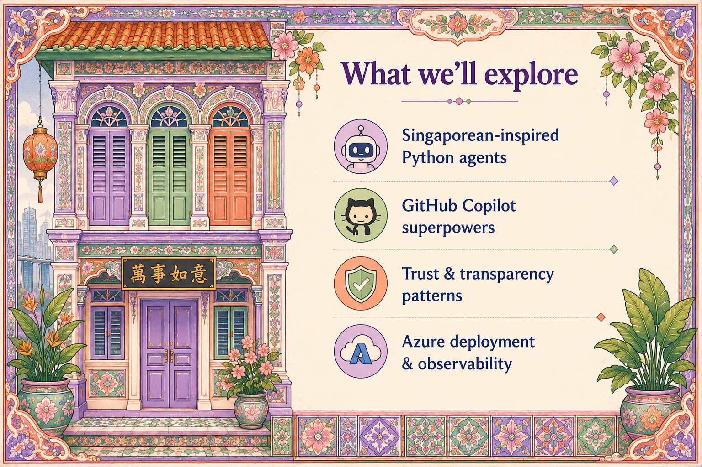

# Chapter 2: What We'll Explore

{ .chapter-hero }

Here are the four signposts for the journey ahead:

1. **Three Singaporean-inspired Python agents**: a hawker recommender, a haze
   tracker, and a Merlion that tells dad jokes.
2. **GitHub Copilot superpowers**: Copilot writing the boring, safety-critical
   scaffolding so you focus on behaviour.
3. **Trust and transparency patterns**: the architectural style that runs
   through all three agents.
4. **Azure deployment and observability**: how this survives contact with real
   users.

## Why it matters

The agenda is also a mental model. Each agent is the *same trust pattern*
applied to a different domain. Once you internalise the pattern, you can add a
fourth or fifth agent without reinventing anything.

## What you get, by role

| If you are a… | You will gain… |
|---|---|
| **Developer** | A Copilot workflow, code patterns, and three runnable examples |
| **Decision maker** | A trust vocabulary and an architecture you can audit |

## Key terms

- **Pattern over product**: you are not buying three bespoke apps; you are
  learning one reusable pattern applied three times.
- **Blast radius**: how much can go wrong when one component fails. Small
  agents mean a small blast radius.

## Do this next

1. Decide which of the three example agents is closest to your real problem.
2. Read that agent's chapter (8, 9, or 10) first, then come back for the
   cross-cutting chapters (6 trust, 11 deploy, 12 observe).

> 📺 **Build 2026 grounding:** the agentic SDLC framing here maps to **DEM303**
> (*Late to agentic coding? Don't panic, build.*).
