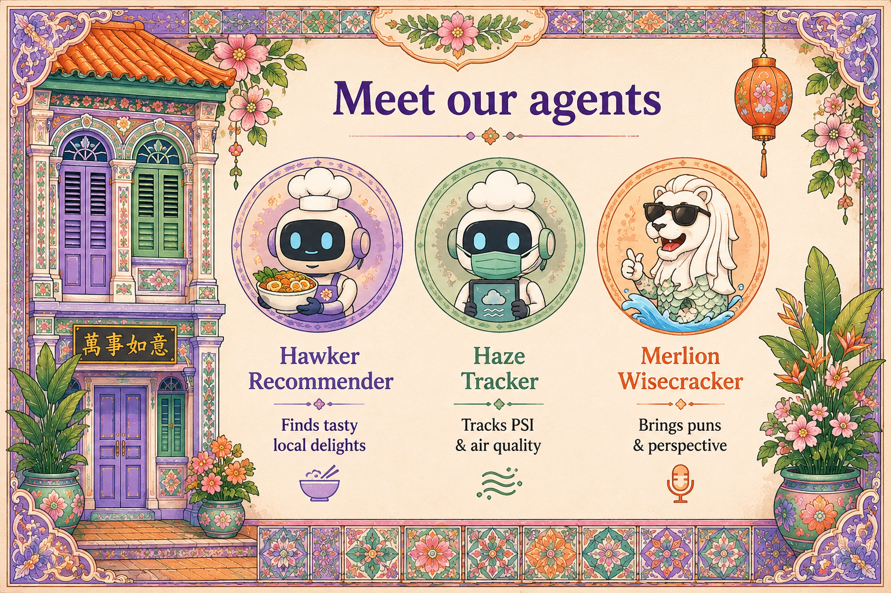

# Chapter 3: Meet Our Agents

{ .chapter-hero }

**Code:** [`src/merlions/agents/`](../../src/merlions/agents)

---

We will work with three agents throughout this guide. Three jobs, and three very
different risk profiles.

| Agent | Job | Main risk | Mitigation |
|---|---|---|---|
| **Hawker Recommender** | Find tasty local food | Hallucinated stalls, stale hours | Real maps tool, RAG over verified menus, cite every source |
| **Haze Tracker** | Watch PSI / air quality | Missed alert, or alert fatigue | Idempotent alerts, fallback data sources, forecast confidence score |
| **Merlion Wisecracker** | Bring puns and perspective | Tone going off the rails | Content guardrail, explicit personality do's/don'ts, refusal path |

Each lives in its own module:
[`hawker.py`](../../src/merlions/agents/hawker.py),
[`haze.py`](../../src/merlions/agents/haze.py),
[`wisecracker.py`](../../src/merlions/agents/wisecracker.py).

## Why three agents instead of one?

**A smaller agent has a smaller blast radius.** Each one has its own tools, its
own prompts, its own evals, and its own permissions. When something goes wrong,
and at scale something always does, you know exactly which agent to fix.

This is the microservices principle applied to cognition: **specialise, govern,
compose.**

## Why it matters (for decision makers)

Separation gives you separate audit trails, separate kill switches, and
least-privilege access per agent. The Hawker agent literally *cannot* read
government haze data; the Haze agent *cannot* tell jokes. Capability scales
without risk scaling with it.

## Key terms

- **Persona / system prompt**: the instructions that define an agent's job and
  boundaries. See each agent's policy in
  [`src/merlions/policies/`](../../src/merlions/policies).
- **Least privilege**: each agent gets only the tools it needs, nothing more.
- **Risk profile**: the specific ways a given agent can fail, and what each
  failure would cost.

## Do this next

1. Open the three agent files and notice how similar their *structure* is and
   how different their *tools and policies* are.
2. For your own project, list your tasks and split them into the smallest
   sensible agents. Write one risk + one mitigation per agent before you write
   any code.

> 📺 **Build 2026 grounding:** the governance-per-agent model aligns with
> **Agent 365** (unified governance for all agents) in [`context.md`](../context.md).
