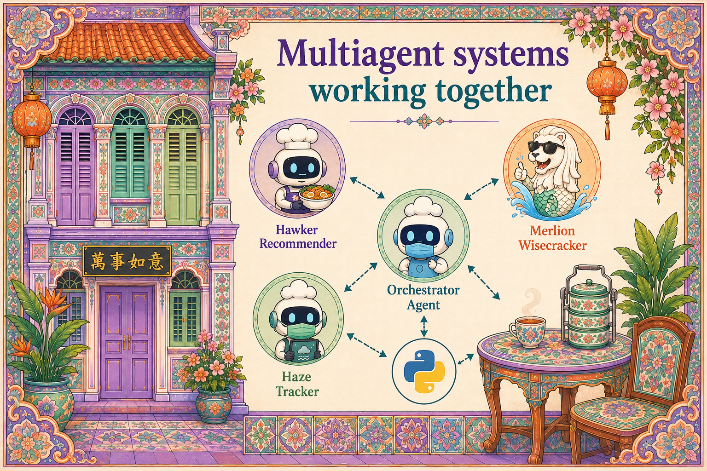

# Chapter 4: Multi-Agent Systems Working Together

{ .chapter-hero }

**Code:** [`src/merlions/agents/router.py`](../../src/merlions/agents/router.py)

---

Three specialised agents are only useful if they work together. The
orchestration is simple: a user asks a question, a **router** (also called a
coordinator or supervisor) decides which agents to call, the agents do their
work in parallel, and the router composes the final answer.

> **The kopitiam analogy:** you order, the auntie at the till routes your order
> to the right stall: chicken rice here, laksa there, kopi over there. Each
> stall is an expert. Nobody tries to do everything.

## How it works (for developers)

The router is **just another agent** whose only job is routing, and whose
**tools are the other agents**. That keeps the system composable: you can add a
fourth agent next week without rewriting the first three.

```text
User question
      │
   ┌──┴──┐  router classifies intent
   │router│  → dispatch (parallel)
   └──┬──┘
 ┌────┼─────┐
 ▼    ▼     ▼
hawker haze wisecracker     ← each least-privilege
 │    │     │
 └────┼─────┘
      ▼
 composed, cited answer
```

See the dispatch logic in
[`router.py`](../../src/merlions/agents/router.py) and the routing policy in
[`policies/router.yaml`](../../src/merlions/policies/router.yaml).

## Why it matters (for decision makers)

This is how you **scale capability without scaling risk**. Each agent has
least-privilege tool access and its own audit trail and kill switch. You are not
building one fragile super-brain; you are composing several small, governable
experts.

## The Python ecosystem

The pattern is framework-agnostic. PydanticAI, CrewAI, LangGraph, and AutoGen
all support router/coordinator topologies. **Pick the one your team likes; the
pattern is what matters, not the library.**

## Key terms

- **Router / coordinator / supervisor**: the agent that classifies intent and
  delegates to specialist agents.
- **Composable**: you can add or replace one agent without touching the others.
- **Fan-out / fan-in**: dispatch to several agents in parallel, then merge
  their results into one answer.
