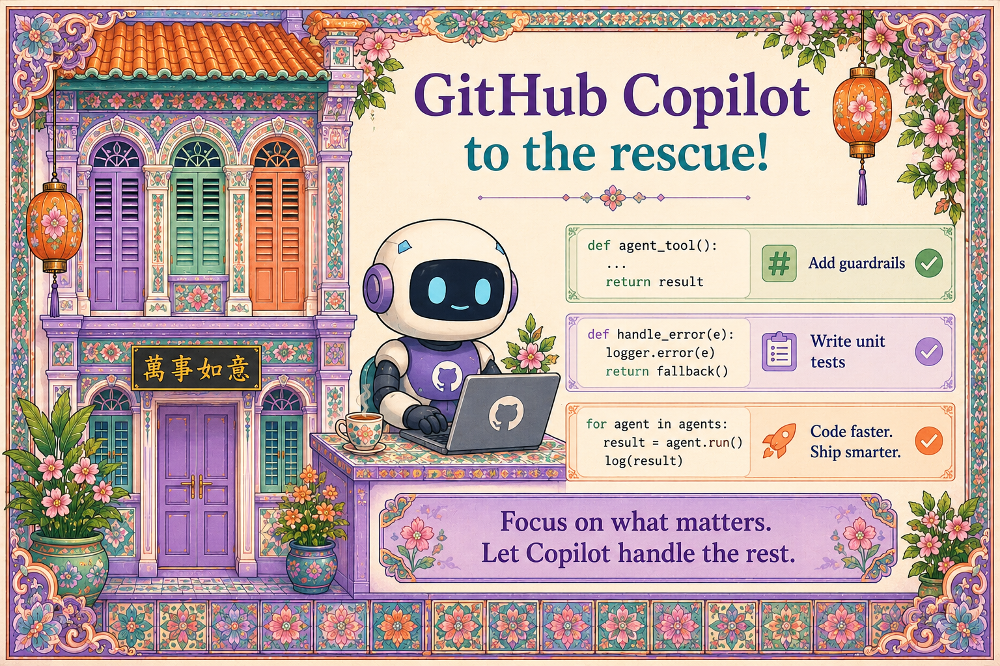

# Chapter 5: GitHub Copilot to the Rescue

{ .chapter-hero }

Building a multi-agent system involves a lot of plumbing: tools, schemas,
guardrails, tests, traces. GitHub Copilot changes the economics. **Not** by
writing the agent for you, but by writing the *boring, safety-critical
scaffolding* fast and consistently.

## The key idea

> Copilot accelerates the safe parts, so you spend your brain on the
> interesting parts: agent behaviour and user experience.

Your domain expertise still matters. What Copilot removes is the repetitive
cost of doing things *correctly*: typed signatures, input validation, policy
wiring, and unhappy-path tests.

## Teach Copilot your standards (do this first)

Out of the box, Copilot does not know your conventions. Fix that with
repository-level instruction files:

| Mechanism | What it does | Where |
|---|---|---|
| `.github/copilot-instructions.md` | Repo-wide instructions every interaction follows | Repo root |
| Rules files | Topic-specific rules (security, testing, architecture) | `.github/copilot/` |
| Prompt files | Reusable prompts for common workflows | `.github/copilot/prompts/` |
| Custom agents & skills | Org-specific workflows Copilot can execute | Org-level |

Good instructions for trustworthy Python agents:

- "Always use type hints."
- "Validate inputs with Pydantic models."
- "Never log PII or secrets."
- "Use structured logging with correlation IDs."
- "Load policy from config, never hardcode it."

## Why it matters

When the surrounding code already follows a pattern, Copilot *extends* that
pattern, even when you do not ask. Conventions become contagious, in a good
way. That is why instruction files are the highest-leverage 20 minutes you can
spend before generating any code.

## Key terms

- **Scaffolding**: the supporting structure around your real logic: types,
  validation, tests, telemetry.
- **Custom instructions**: repo/org files that teach Copilot your standards so
  its suggestions match your codebase.
- **TDD with Copilot**: write (or generate) tests first, then let Copilot
  implement against them.
