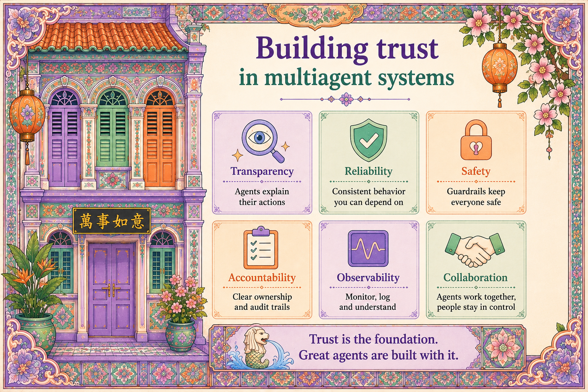

# Chapter 6: Trust Is Our Architectural Style

{ .chapter-hero }

---

Think of trust as four pillars. Like the load-bearing walls of a Peranakan
shophouse, they are not decoration added at the end. Trust is the *style* that
runs through every wall.

| Pillar | What it means | In this repo |
|---|---|---|
| **Transparency** | The agent explains its decisions and cites sources | `require_citation` in policy config |
| **Safety** | Guardrails, validation, allowlists, content checks (**fail closed**) | Governance decorator on every tool |
| **Reliability** | Retries, fallbacks, idempotency | Haze fallback chain, dedupe keys |
| **Observability** | Logs, metrics, traces for every decision | OpenTelemetry spans on every call |

## Each pillar, concretely

- **Transparency**: "Why this hawker stall? Because of these reviews, this
  distance, this menu match." Never "because the model said so."
- **Safety**: input validation, output filtering, tool allowlists, content
  checks. **Fail closed:** if a check errors or is ambiguous, deny the action.
- **Reliability**: if the maps API is down, fall back to cached data and *say
  so*. If the user asks twice, do not double-book. Boring. Critical.
- **Observability**: every tool call, every guardrail decision, every refusal.
  *If you can't see it, you can't trust it.*

## This is now an industry standard

The four pillars line up with the Build 2026 throughline:

- **Trace** with **OpenTelemetry's GenAI semantic conventions**.
- **Enforce** with the new **Agent Control Specification**, a universal runtime
  standard that turns agent safety from best-effort into *deterministic
  control* (tool allowlists, content filters, rate limits, human-in-the-loop).
- **Improve** with **continuous evaluation** on every agent action.

## Why it matters (for decision makers)

These four words are also how you have a sensible conversation with security and
compliance. Instead of "it's AI, it's magic," you can say: *"here's the
allowlist, here are the traces, here's the eval suite."*

> If a vendor pitches you an agent and can't show you all four pillars, walk
> away. If you are a developer, design them in from line one. Retrofitting
> trust is ten times more expensive.

## Key terms

- **Fail closed**: when uncertain, deny. The safe default.
- **Policy as configuration**: guardrails live in YAML, not hardcoded, so they can change without a redeploy.
- **Audit trail**: a durable, queryable record of what the agent decided and
  why.
