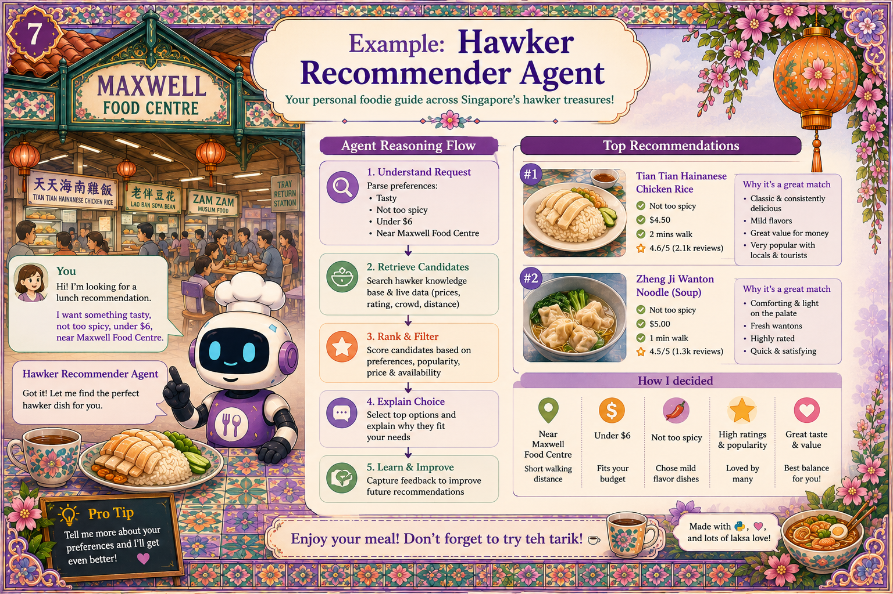

# Chapter 8: Hawker Recommender Agent

{ .chapter-hero }

**Code:** [`src/merlions/agents/hawker.py`](../../src/merlions/agents/hawker.py)

---

Picture a simple exchange. User: *"Recommend dinner near me."* Agent:
*"Hainanese chicken rice at Maxwell today."* It looks simple, but underneath,
three things happen.

## The pattern: tool → retrieve → ground → cite

**1. Tool use.** The agent called a maps tool to find nearby hawker centres. The
tool is on an allowlist: it can *read* locations. It cannot write, pay, or
book. **Least privilege.** See
[`tools/maps.py`](../../src/merlions/tools/maps.py).

**2. RAG (retrieval-augmented generation).** The agent retrieves from a verified
menu dataset rather than guessing what a stall serves, then phrases it nicely.
**Grounded.** See [`tools/menu_index.py`](../../src/merlions/tools/menu_index.py).

**3. Trust.** Every claim is validated against the retrieved source, and every
answer cites which stall, which review, which date. If the agent can't find a
citation, it says *"I'm not sure; here's what I do know."* **Honest about
uncertainty.** The policy
([`policies/hawker.yaml`](../../src/merlions/policies/hawker.yaml)) sets
`require_citation: true`.

## Why "grounded" actually matters

> Grounded means the output is *traceable to a source you control.*

So when a user complains about a bad recommendation, you can debug it: fix the
data, add a test, ship. It is an engineering problem, not a mystery.

And note what we **did not** do: we did not fine-tune a model on hawker data.
**Tool use plus retrieval gets ~90% of the value at ~10% of the cost.** Keep
that in your back pocket the next time someone pitches an expensive fine-tune.
## Refusal is a feature

If the user shares no location and no preference, the Hawker agent **refuses**
and asks for one. It does not pick a random stall. A refusal beats a
hallucination every time.

## Key terms

- **RAG**: retrieve relevant facts from a trusted store, then let the model
  phrase them. Reduces hallucination dramatically.
- **Citation**: a pointer to the exact source backing each claim
  (e.g. `menu_index/satay-bay/2026-06-13`).
- **Least-privilege tool**: read-only where possible; no side effects unless
  explicitly required and approved.

## Do this next

1. Read [`hawker.py`](../../src/merlions/agents/hawker.py) and follow the
   tool → retrieve → ground → cite flow.
2. Add `require_citation` to one of your own agents and make it refuse when it
   can't cite.
3. Before reaching for fine-tuning, try tool use + retrieval first.

> 📺 **Build 2026 grounding:** **LTG427** (*Rubric-Based Evaluation*) for turning
> "must cite a source" into an automated test, and built-in **Groundedness**
> evaluators in [`context.md`](../context.md).
