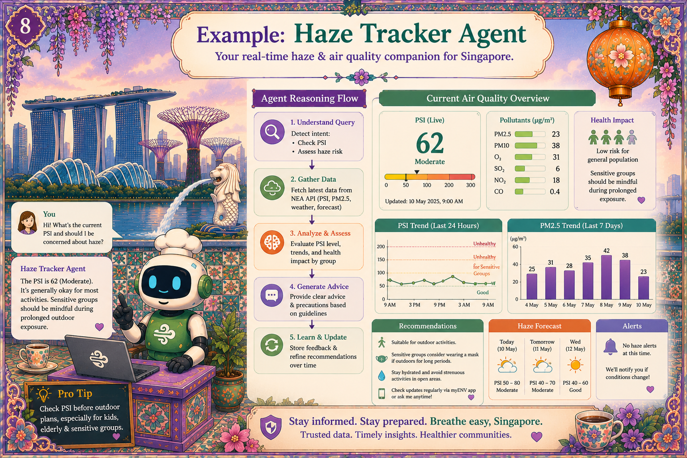

# Chapter 9: Haze Tracker Agent

{ .chapter-hero }

**Code:** [`src/merlions/agents/haze.py`](../../src/merlions/agents/haze.py)

---

Consider a typical response: *"PSI eighty-two, moderate. Take care, drink water,
stay indoors."* Anyone who has lived through a Singapore haze season knows this
is not a toy. People use this to decide whether to send kids to school or run
outside. **The cost of a wrong answer is real.**

## The pattern: ingest → forecast → alert

**1. Ingest.** The agent pulls from NEA's public PSI feed. Tool use,
allowlisted, read-only. See [`tools/nea.py`](../../src/merlions/tools/nea.py).

**2. Forecast.** A small forecasting step projects the next few hours and
attaches a **confidence score**. Low confidence? The agent says so. It does not
fake certainty.

**3. Alert (idempotent).** If the PSI crosses into "unhealthy" at 7am, you get
**one** alert. Not five. Not one per refresh. The agent remembers what it told
you and does not spam you at 3am unless something truly changed.

## Two reliability properties to steal

### Idempotency

> The most under-rated property in agent design.

It is the difference between a useful assistant and a creepy stalker. Implement
a **dedupe key** on every external side-effect so repeating the same action is a
no-op.

### Fallback chain

The Haze agent degrades gracefully:

1. NEA live feed
2. Cached data
3. A clear *"data unavailable, please check nea.gov.sg"* message

**It never invents a PSI number.** Failing *visibly* beats failing silently,
every time.

## The bigger point

The Hawker and Haze agents are **the same trust pattern applied to different
domains**: same vocabulary (ingest, ground, validate, trace), same
observability, same kill switch. You are not buying three bespoke products; you
are buying one pattern, applied three times.

## Key terms

- **Idempotent**: doing the same operation twice has the same effect as doing
  it once. Essential for alerts and any write/side-effect.
- **Dedupe key**: a stable identifier for an action so duplicates are
  suppressed.
- **Confidence score**: an honest numeric signal of how sure the forecast is;
  surfaced to the user instead of hidden.
- **Graceful degradation**: a defined fallback chain so the system stays useful
  when a dependency fails.

## Do this next

1. Read [`haze.py`](../../src/merlions/agents/haze.py) and find the dedupe key
   and the fallback chain.
2. Add a dedupe key to any agent action in your system that has a side effect.
3. Make every external dependency in your agent have an explicit fallback and a
   visible "data unavailable" path.

> 📺 **Build 2026 grounding:** reliability + tracing patterns in **TT640**
> (*Any agent, any cloud: Observability patterns*).
