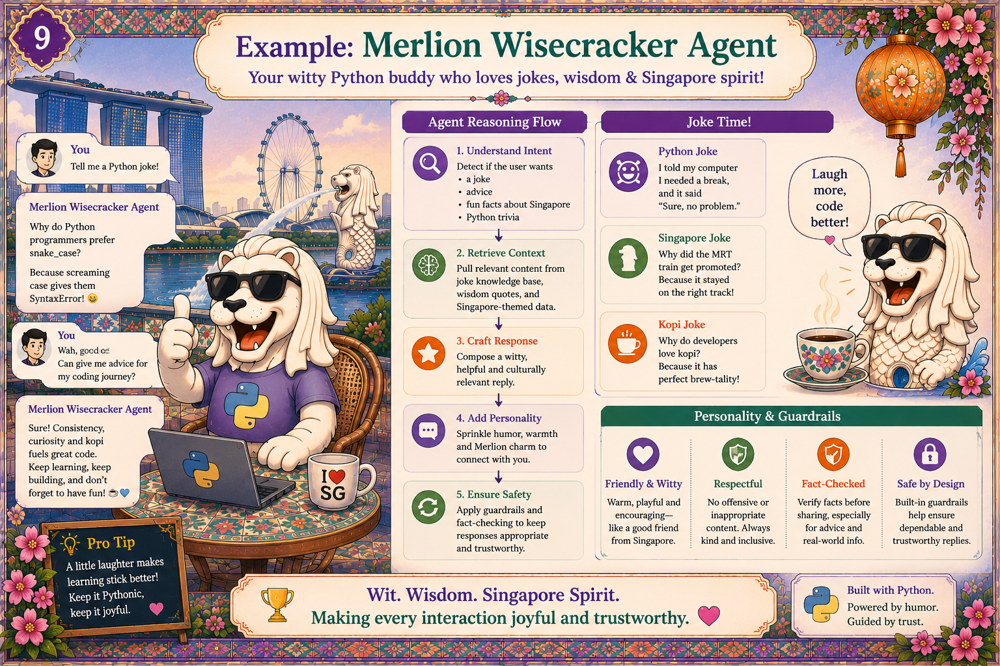

# Chapter 10: Merlion Wisecracker Agent

{ .chapter-hero }

---

*"Why do Python devs love the sea? Because they prefer high tide and high code
quality."* The joke is fun. The system around it is serious: **personality, safe
by design, grounded responses.**

## Personality with guardrails

The Wisecracker has the same trustworthy foundation as the other two agents,
plus a personality layer on top:

- **A content guardrail** scans inputs and tool arguments for unsafe patterns.
- **A personality prompt** with explicit do's and don'ts keeps the tone in
  bounds.
- **A refusal path** for when input gets weird: humour never overrides safety.

> Personality is a product feature. **Trust is what lets you ship it.** Without
> the guardrails, you would never let this agent talk to a real customer.

## Walkthrough: all three agents on one composite question

Send a single question that touches all three domains:

```text
> Dinner near Marina Bay, is the air OK to walk there, and make me laugh.
```

When you run it, you'll see:

1. The **router** classifies intent and **dispatches to all three agents in
   parallel** (see [Chapter 4](04-multiagent.md)).
2. Each agent uses only the tools on its own allowlist: the Hawker agent can't
   read PSI; the Haze agent can't tell jokes.
3. A **composed answer** where every factual claim has a citation, and the pun
   is the only thing without one, intentionally, because humour is opinion, not
   fact.
4. A **trace tree**: one parent span, three children, ~600ms end-to-end.

## Why the un-cited pun is correct

Citations attach to *factual* claims. The joke is explicitly *opinion/humour*,
governed by the humour policy. Separating "fact that must be grounded" from
"opinion that must be safe" is a deliberate design choice, not an oversight.

## Key terms

- **Content guardrail**: a filter that scans inputs *and* tool arguments for
  unsafe or sensitive patterns.
- **Personality prompt**: explicit tone instructions (do's and don'ts) layered
  over the safe foundation.
- **Composite question**: one user message that requires several agents to
  answer fully.
