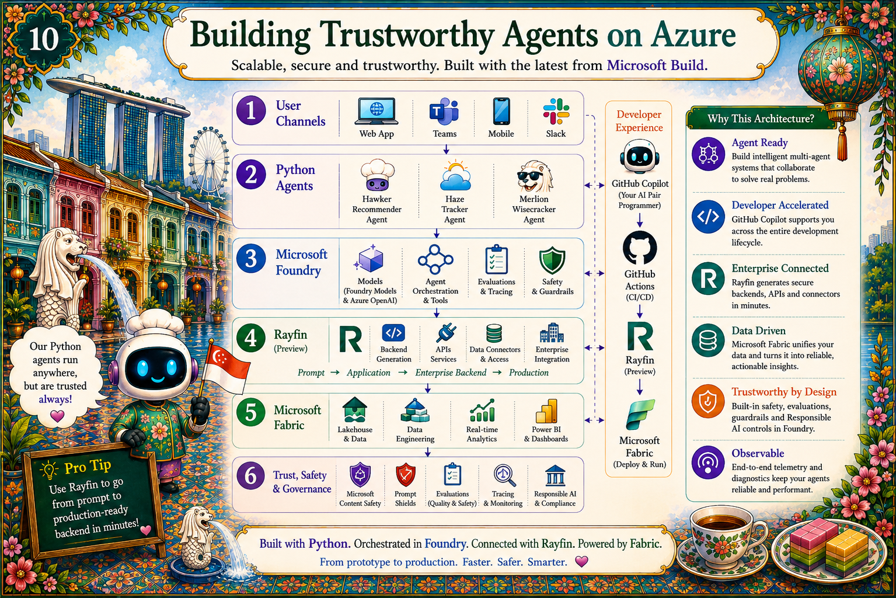

# Chapter 11: From Local to Cloud: Azure

{ .chapter-hero }

Here is a layered architecture for shipping trustworthy agents on Azure, with
the reassuring news that **you don't need a Kubernetes cluster or a platform
team.** A small set of managed services does the job.

## The core four (start here)

| Service | Role | Why it fits agents |
|---|---|---|
| **Azure Container Apps** | Run the agents | Serverless, scale-to-zero, revisions for safe rollout + instant rollback |
| **Application Insights** (Azure Monitor) | Observability | Traces every tool call and guardrail decision via OpenTelemetry |
| **Azure Cosmos DB** | State + RAG store | Low latency, multi-region, fits the agent access pattern |
| **Azure Key Vault** | Secrets | API keys and endpoints out of code, forever; managed identity does the rest |

A Python agent can be in production the same afternoon: `az containerapp up`
once the basics are set.

## The trust layer (this is where Build 2026 lands)

On top of the runtime, wire in the platform safety services:

- **Content Safety / Prompt Shields**: block jailbreaks and prompt injection at
  the boundary.
- **Evaluations**: continuous, sampled quality + safety scoring on real traffic.
- **Tracing**: OpenTelemetry GenAI spans flowing into Application Insights.
- **Responsible AI**: policies, red-teaming, and human-in-the-loop for
  high-impact actions.

On **Microsoft Foundry**, much of this is built in: agent hosting, the
Observability dashboard, and continuous evaluation in one place.

## The data layer: Microsoft Fabric + Rayfin

Grounded agents are only as good as the data behind them, so the architecture
includes a data layer:

- **Microsoft Fabric**: the unified analytics platform where your RAG sources,
  eval datasets, and telemetry can live and be governed together.
- **Rayfin** *(Preview, announced at Build 2026)*: Microsoft Fabric's way to
  **build enterprise apps faster** on top of your Fabric data. For an agent, it
  shortens the path from "data in Fabric" to "an app/endpoint your agent can
  call," so the grounded store stays close to the analytics it came from. See
  [Build enterprise apps faster with Rayfin](https://www.microsoft.com/en-us/microsoft-fabric/features/rayfin).

The point for builders: keep your **grounding data, evals, and observability**
on one governed platform so the feedback loop in [Chapter 12](12-observe.md) has
clean, trustworthy inputs.

## Patterns worth naming

- **Separate the agent runtime from the data plane.** Container Apps for the
  agent, Cosmos for state, Key Vault for secrets, App Insights for telemetry.
  Upgrade any one piece without breaking the others. That is how you survive 18
  months of model and framework churn.
- **Use managed identity** between Container Apps, Cosmos, and Key Vault. No
  secrets to rotate.
- **Put prompts and policies in config, not code**, so you can change a
  guardrail without redeploying (see
  [`policies/`](../../src/merlions/policies)).
- **Turn on Application Insights on day one**, not day ninety. Retrofitting
  traces is painful.

## Why it matters (for decision makers)

Every service here is **managed**: Microsoft handles patching, scaling, and
redundancy. Your team spends its time on agent behaviour and user experience,
which is the only place your competitive advantage lives. And each service has a
**Southeast Asia regional presence**, so data stays close and compliance teams
stay happy.

## Key terms

- **Scale-to-zero**: pay nothing when idle; scale up on demand. Ideal for spiky
  agent traffic.
- **Managed identity**: service-to-service auth with no stored secrets
  (`DefaultAzureCredential` in Python).
- **Data plane vs. runtime**: keep where the agent *runs* separate from where
  data *lives*.
- **Microsoft Foundry**: Microsoft's agent platform (agents, evaluation,
  observability); the current name evolved from Azure AI Foundry.
- **Microsoft Fabric**: the unified, governed data + analytics platform that
  can hold your RAG sources, eval datasets, and telemetry.
- **Rayfin** *(Preview)*: a Microsoft Fabric capability for building enterprise
  apps faster directly on Fabric data.

## Do this next

1. Stand up the core four in a test resource group and deploy one agent with
   `az containerapp up`.
2. Move every secret into Key Vault and switch to managed identity.
3. Enable Application Insights and confirm you see a tool-call trace before you
   add features.

> 📺 **Build 2026 grounding:** **DEM341** (Foundry + OpenTelemetry tracing) and
> the Agent 365 / Entra / Defender / Purview governance stack in
> [`context.md`](../context.md).
