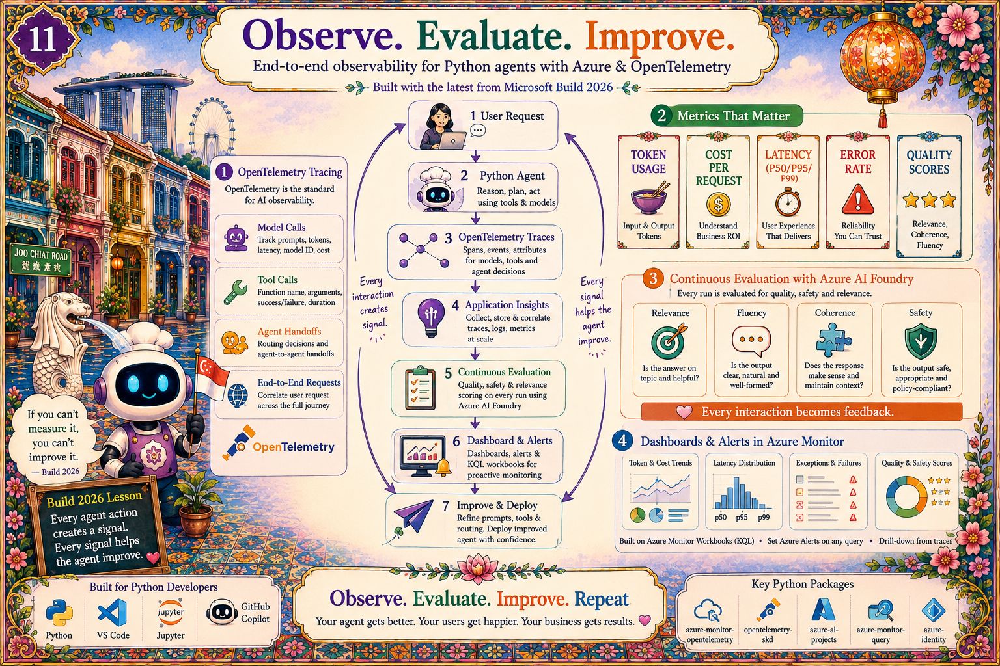

# Chapter 12: Observe. Evaluate. Improve.

{ .chapter-hero }

**Code:** [`src/merlions/telemetry.py`](../../src/merlions/telemetry.py) · [`src/merlions/evals/`](../../src/merlions/evals)
**Runner:** [`talk/demos/demo3.ps1`](../demos/demo3.ps1)

---

Trustworthy agents run on a continuous feedback loop: **Collect → Understand →
Improve**. Picture it as a circle, where every agent action becomes a signal that
feeds the next improvement.

## The loop

**Collect:** logs, metrics, traces. Every tool call, every guardrail decision,
every refusal, every latency. Default on. Emitted as **OpenTelemetry** spans;
see [`telemetry.py`](../../src/merlions/telemetry.py).

**Understand:** dashboards and alerts. What's slow? What's failing? Which
guardrails are firing, too much or not enough?

**Improve:** feedback loops and evals. Take real traces, turn them into eval
cases, run them every CI build. The agent gets measurably better, week over
week. See [`evals/cases.jsonl`](../../src/merlions/evals/cases.jsonl) and
[`evals/runner.py`](../../src/merlions/evals/runner.py).

## A worked example

Run `./talk/demos/demo3.ps1` and you'll see the loop in action:

1. **A real tool-call trace** in Application Insights, ~380ms end-to-end, with
   custom dimensions: `agent_id`, `policy` version, `decision=allow`,
   `tools_used`.
2. **A guardrail rejection** logged with the **matched rule** and **redacted
   evidence**, *not* the user's raw prompt. **Log decisions, not content.**
3. **The eval loop closing**: a real rejection becomes the next eval case and
   catches a latency regression overnight.

## Continuous evaluation (the Build 2026 push)

Beyond your own eval cases, Microsoft Foundry offers **continuous evaluation**:
built-in evaluators scoring a *sampled slice of real traffic*:

- **Quality**: Relevance, Groundedness, Coherence, Fluency.
- **Safety / risk**: jailbreak detection, protected-material and code-
  vulnerability checks, hate/violence/self-harm/sexual content.
- **AI Red Teaming Agent**: automatically probes for jailbreaks, prompt
  injection, and data exfiltration.

The mantra: **Observe. Evaluate. Improve. Roll out safely. Repeat.**

## Privacy by design

> Log the *decision and the rule*, never the raw prompt.

This keeps your audit trail useful *and* your privacy review happy. Evidence is
the redacted pattern match, plus a redacted user ID: enough to debug, not
enough to leak.

## Key terms

- **OpenTelemetry (OTel)**: the open standard for traces/metrics/logs; the
  GenAI semantic conventions add model/tool/agent spans.
- **Continuous evaluation**: automated quality + safety scoring on sampled
  production traffic.
- **Eval case**: a recorded input + expected behaviour that runs in CI to catch
  regressions.
- **Trace span**: one timed unit of work (a tool call, an LLM call) within a
  larger request tree.
