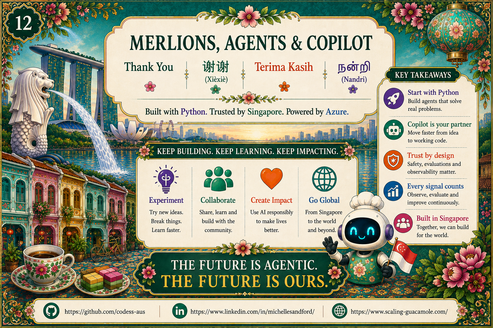

# Chapter 13: Where to Go From Here

{ .chapter-hero }

Three takeaways to carry home.

## Three takeaways

1. **Specialise your agents.** Small, focused, governed. Not one mega-agent, but
   several little ones that collaborate. *Smaller agent, smaller blast radius.*
2. **Build trust *in*, not *on*.** Transparency, safety, reliability,
   observability, designed in from line one. Retrofitting trust is ten times
   more expensive.
3. **Ship to Azure with observability from day one.** Container Apps, Cosmos,
   Key Vault, Application Insights. A boring stack with reliable outcomes.

## If you are a developer

Do this in your next week. It changes how you build forever:

- Clone the repo and run the three examples
  ([`talk/demos/README.md`](../demos/README.md)).
- **Ship one tool** with a typed signature and input validation.
- **Add one guardrail** as policy-as-configuration (see
  [`policies/`](../../src/merlions/policies)).
- **Write one eval** from a real failure (see
  [`evals/`](../../src/merlions/evals)).

## If you are a decision maker

Go back to your team and ask three questions. If you don't get clear answers,
you've found your roadmap:

1. *Where are our agents' guardrails?*
2. *Where are our traces?*
3. *Where are our evals?*

## The closing thought

Singapore works because everyone respects the system: the queue at the hawker
stall, the rules of the MRT, the **trust** that lets a million strangers
cooperate every day. Our agents need the same thing: personality, yes; speed,
absolutely; but **trust** is what makes them useful at scale.

> Go build agents that are friendly, fast, *and* trustworthy. Singapore style.
> **Lah, let's build.** 🦁

## Where to go next

- **This repo:** [`README.md`](../../README.md), the three agents in
  [`src/merlions/agents/`](../../src/merlions/agents), and the eval suite.
- **The chapters:** revisit [Chapter 6 (Trust)](06-trust.md),
  [Chapter 11 (Azure)](11-azure-deploy.md), and
  [Chapter 12 (Observe)](12-observe.md) as your build checklist.
- **Build 2026 sessions:** the full list with codes is in
  [`talk/context.md`](../context.md).

> 📺 **Build 2026 grounding:** **DEM303** (*Late to agentic coding? Don't panic,
> build.*), the encouragement to just start.
