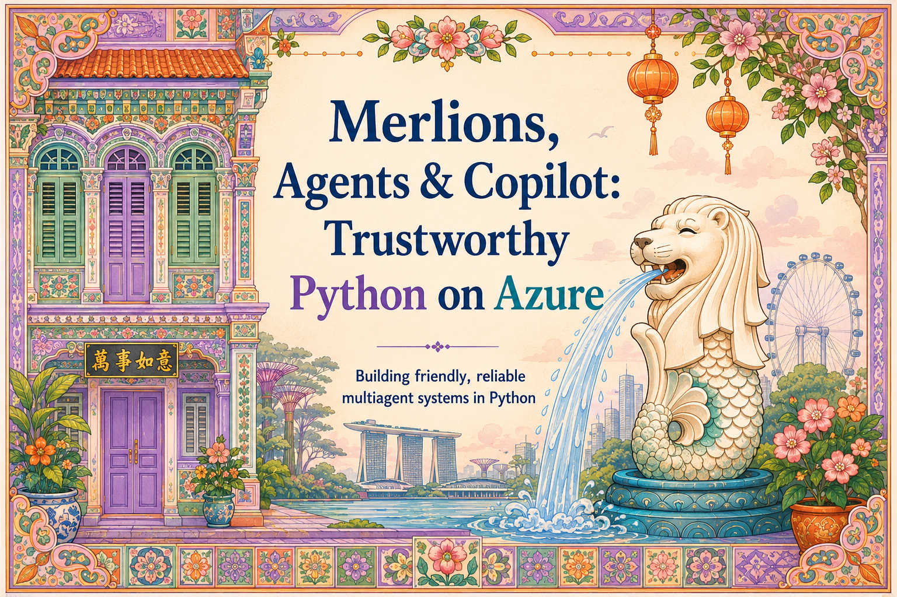

# Chapter 1: Why Trust?

{ .chapter-hero }

This guide is about building AI agents in Python (on Azure, with GitHub
Copilot) that you can actually trust in front of customers you care about.

There is a tension at the heart of it: the difference between *trusting a local hawker uncle* who has cooked the same dish for thirty years, and *trusting
a chatbot* you met five seconds ago. Closing that gap is the whole job.

## Why trust is the hard part

A polished demo is easy; that is what demos are *for*. The hard part is the gap
between a demo and a system that strangers depend on every day. An agent that
dazzles on a laptop can still hallucinate facts, leak data, fail to explain
itself, or fall over under real traffic. "Trustworthy" is not a vibe. It is a
set of concrete engineering properties you can design for, test, and observe.

This guide gives you two things:

- **Developers** get a copyable pattern (small agents, guardrails,
  observability) and three working examples to run.
- **Decision makers** get a vocabulary (*transparency, safety, reliability,
  observability*) and a sense of what each one costs and buys.

## The promise

No magic mega-agent. Instead: **small, specialised, well-governed agents that
collaborate.** That is the pattern that actually ships.

## Key terms

- **Agent**: an LLM-driven program that can call tools, make decisions, and
  produce an answer, often over multiple steps.
- **Trustworthy**: explainable, safe, reliable, and observable. The rest of
  these chapters define each property concretely.

## Do this next

1. Clone the repo: [`README.md`](../README.md) has setup steps.
2. Skim the source layout under [`src/merlions/`](../src/merlions): three
   agents, their tools, their policies, and an eval suite.
3. Read the chapters in order, or jump to the agent that matches your use case.

> 📺 **Go deeper:** the Microsoft Build 2026 sessions that inform this guide are
> listed in [`talk/context.md`](../talk/context.md). Start with **BRK250** (observe
> and control agents across any framework).
